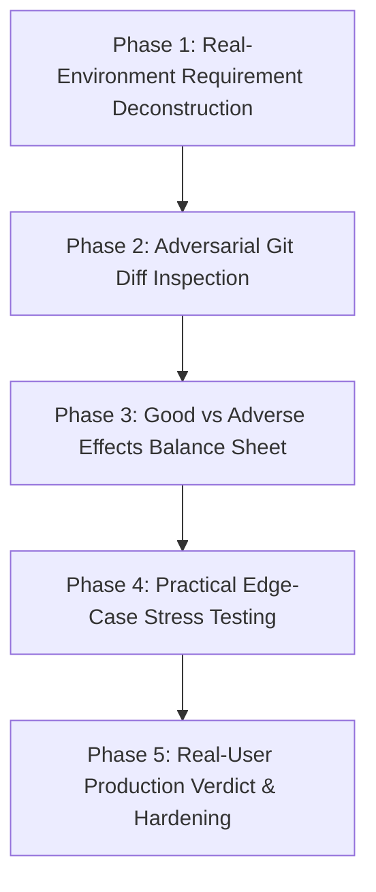

# /codereview — Critical User-First Code Review Framework

This skill and slash command guide the agent in performing deep, adversarial, and completely unbiased code reviews.

The standard developer review is inherently prone to **confirmation bias**: the author built a solution, wrote happy-path unit tests that conform to their mental model, and seeks to validate their own work.
In contrast, a **real user / production operator** does not care about how clever the implementation is; they care about:
1. **Safety & Capital Preservation**: Will this glitch and drain my live account?
2. **Operational Reality**: How does this behave under live market stress, socket latency, missing ticks, or high news volatility?
3. **Cognitive Load & Ergonomics**: Does this make my daily workflow smoother, or does it clutter my screen, demand unnecessary clicks, and overwhelm my attention?
4. **Adverse Side Effects**: What did this change break or destabilize that wasn't mentioned in the original pull request?

---

## The 5-Phase Review Protocol

When executing `/codereview`, strictly adhere to the following 5 phases:



---

### Phase 1: Real-Environment Requirement Deconstruction
*Never evaluate code against a synthetic ticket description. Evaluate it against the living production ecosystem.*

1. **Deconstruct the Core User Intent**:
   - What pain point did the user actually experience?
   - What was the intended trading/user outcome vs the technical request?
2. **Audit Physical Production Constraints**:
   - **Infrastructure**: Broker bridge sockets (e.g. MetaTrader 5, FIX API, WebSockets), DB connection pooling, rate limits.
   - **Data Realities**: Non-ideal market conditions (gaps over weekend, spread spikes at roll-over, dropped ticks, stale historical bars).
   - **Execution Realities**: Slippage, spread friction, asymmetric liquidity, broker execution rejection.
   - **UI/UX Realities**: Mobile vs Desktop screen real estate, render cycles, notification fatigue.

---

### Phase 2: Adversarial Diff Inspection (The Devil's Advocate)
*Inspect every modified file through the eyes of a skeptical auditor actively looking for bugs.*

1. **Denial of Confirmation Bias**:
   - Do NOT assume green unit tests mean the code is safe. Unit tests frequently replicate the author's blind spots.
2. **Audit Checkpoints**:
   - **Mathematical & Numeric Integrity**: Check for division by zero, denominator collapse (e.g. `riskDist -> 0`), precision rounding bugs (`toFixed(5)` vs float comparison), and NaN propagation.
   - **Asynchronous Flow & Concurrency**: Check for unhandled Promise rejections, parallel database writes causing race conditions, socket exhaustion, or missing await statements.
   - **State Isolation & Mutation**: Are objects shared across iterations or mutated in place? Could one symbol's evaluation contaminate another?
   - **Deduplication & Veto Leaks**: Are filters too strict (locking out legitimate opportunities) or too loose (allowing invalid duplicate orders to pass)?
   - **Memory & Lifecycle**: Are event listeners, intervals, caches, or Maps growing unbounded without eviction or garbage collection?

---

### Phase 3: The "Good vs Adverse Effects" Balance Sheet
*Provide a balanced, objective ledger comparing architectural gains against latent risks.*

For every significant change, formulate an explicit ledger:

| Dimension | The Good (Architectural Gains) | Adverse Effects & Latent Risks (User Impact) |
|---|---|---|
| **Core Functionality** | Requirements satisfied, bug resolved, new capability unlocked. | Unintended behavioral shifts, changed defaults, edge-case veto locks. |
| **System Performance** | Algorithmic efficiency, vectorization, caching. | Increased CPU cycles, memory bloat ($3\times$ items in memory), network socket pressure. |
| **User Experience (UX)** | Clear telemetry, intuitive badges, flexible filters. | Visual clutter, information overload, double clicks, confusing card proliferation. |
| **Risk Management** | Dynamic protection, tighter stops, realistic R:R. | Over-allocation across concurrent legs, conflicting trade directions on same asset. |

---

### Phase 4: Practical Edge-Case Stress Testing
*Challenge the changes with scenarios designed to break assumptions.*

Execute automated scripts or synthetic verification probing:
1. **Boundary Values**: Zero spread, negative coverage, missing timeframes, 1-tick bar histories.
2. **Contradictory States**: Symbol simultaneously showing Bullish Swing and Bearish Scalp—how does the copier/risk engine handle opposing directional risk on the same account?
3. **High-Stress Scenarios**: Rapid consecutive triggers, database reconnects mid-staging, broker disconnects during approval.

---

### Phase 5: Real-User Production Verdict & Hardening
*Deliver an honest, non-defensive verdict with actionable remediation.*

Every review must conclude with one of three verdicts:
1. `🟢 PRODUCTION READY`: Flawless implementation with zero adverse side effects and proven resilience.
2. `🟡 FUNCTIONAL WITH ADVERSE TRADEOFFS`: Solves the requirement but introduces operational friction or visual clutter that requires hardening. Provide exact remediation steps.
3. `🔴 REJECTED / HIGH PRODUCTION RISK`: Introduces silent bugs, race conditions, over-allocation risk, or severe performance degradation. Must be reworked before deployment.

---

## Review Output Format

When executing `/codereview`, format the review output using this structured markdown template:

```markdown
# 🔍 Critical User-First Code Review

## 1. Requirement & Live Operational Context
[Summary of what the user needed vs what production demands]

## 2. Adversarial Code Audit
[Deep-dive into modified code, pointing to exact file lines and potential pitfalls]

## 3. Good vs Adverse Effects Ledger
### ✅ The Good (Real Value Delivered)
- ...
### ⚠️ Adverse Effects & Latent Risks (Real-User Perspective)
- ...

## 4. Operational Stress & Edge-Case Findings
[Specific edge cases tested or flagged]

## 5. Final Production Verdict & Hardening Recommendations
**Verdict**: [🟢 / 🟡 / 🔴]
**Actionable Hardening Steps**:
1. ...
```
